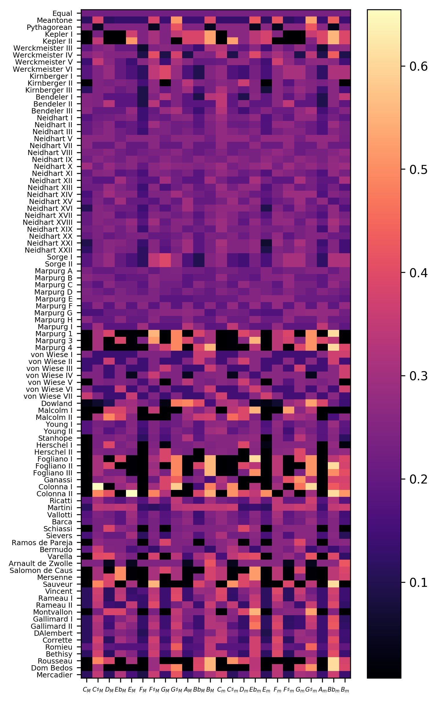
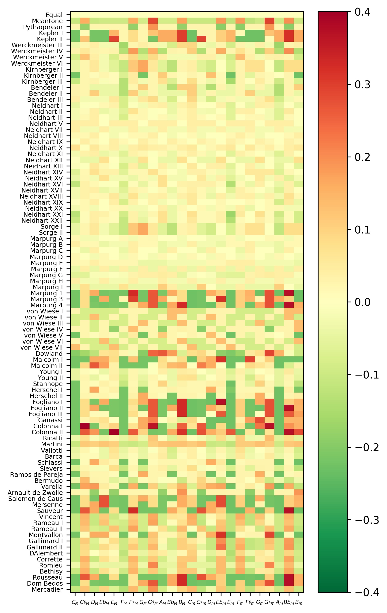

# py_consonances
Python code for comparing the consonance of major/minor chords in various tunings

See [here](https://alpof.wordpress.com/2015/04/05/consonance-calculations-1/) and
[here](https://alpof.wordpress.com/2015/10/11/consonance-calculations-2-tunings/)
for more information.

Consonance values of major/minor chords, relative to pure chords, for different tunings

Consonance values of major/minor chords, relative to equal temperament, for different tunings

